## Monitoring, Alerting, and Visualization on Azure Arc-enabled servers

The scenario will show you how to onboard Azure Arc-enabled servers to [Azure Monitor](https://docs.microsoft.com/azure/azure-monitor/overview), so you can monitor your Linux and Windows servers running on-premises or at other cloud providers.

in this scenario, you will create the following Azure resources that support this Azure Monitor scenario:

- Log Analytics workspace.

- Log data sources: performance counters and events for Windows & Linux.

- VM Insights solution.

- Azure Monitor OS sample alerts.

- Azure Workbooks: AlertsConsole, OSPerformanceAndCapacity and WindowsEvents.

- Azure Dashboard: monitoring overview for Azure Arc-enabled servers.

- Azure Policies to automate agents deployment:

  - Configure Log Analytics extension on Azure Arc enabled Windows servers.

  - Configure Log Analytics extension on Azure Arc enabled Linux servers.

  - Configure Dependency agent on Azure Arc enabled Windows servers.

  - Configure Dependency agent on Azure Arc enabled Linux server.

> **NOTE: This guide assumes you already deployed VMs or servers that are running on-premises or other clouds and you have connected them to Azure Arc. If you haven't, this repository offers you a way to do so in an automated fashion:**

- **[GCP Ubuntu instance](https://azurearcjumpstart.io/azure_arc_jumpstart/azure_arc_servers/gcp/gcp_terraform_ubuntu/)**
- **[GCP Windows instance](https://azurearcjumpstart.io/azure_arc_jumpstart/azure_arc_servers/gcp/gcp_terraform_windows/)**
- **[AWS Ubuntu EC2 instance](https://azurearcjumpstart.io/azure_arc_jumpstart/azure_arc_servers/aws/aws_terraform_ubuntu/)**
- **[AWS Amazon Linux 2 EC2 instance](https://azurearcjumpstart.io/azure_arc_jumpstart/azure_arc_servers/aws/aws_terraform_al2/)**
- **[Azure Ubuntu VM](https://azurearcjumpstart.io/azure_arc_jumpstart/azure_arc_servers/azure/azure_arm_template_linux/)**
- **[Azure Windows VM](https://azurearcjumpstart.io/azure_arc_jumpstart/azure_arc_servers/azure/azure_arm_template_win/)**
- **[VMware vSphere Ubuntu VM](https://azurearcjumpstart.io/azure_arc_jumpstart/azure_arc_servers/vmware/vmware_terraform_ubuntu/)**
- **[VMware vSphere Windows Server VM](https://azurearcjumpstart.io/azure_arc_jumpstart/azure_arc_servers/vmware/vmware_terraform_winsrv/)**
- **[Vagrant Ubuntu box](https://azurearcjumpstart.io/azure_arc_jumpstart/azure_arc_servers/vagrant/local_vagrant_ubuntu/)**
- **[Vagrant Windows box](https://azurearcjumpstart.io/azure_arc_jumpstart/azure_arc_servers/vagrant/local_vagrant_windows/)**

## Prerequisites

- As mentioned, this scenario starts at the point where you already deployed and connected VMs or bare-metal servers to Azure Arc. **The resource group of these Azure Arc-enabled servers must be the same as the one that will be used for this scenario deployment.** This is required since the Azure Policies that deploy the Log Analytics agent and the Dependency agent are assigned at this resource group level. In this scenario, we will use the following instances that have been already connected to Azure Arc and are visible as a resources in Azure:

    

    > **NOTE: Ensure that the servers you will use for this scenario are running an [OS supported by the Log Analytics Agent and the Dependency Agent](https://docs.microsoft.com/azure/azure-monitor/agents/agents-overview#supported-operating-systems) and meets the [firewall requirements](https://docs.microsoft.com/azure/azure-monitor/agents/log-analytics-agent#firewall-requirements).**

- [Install or update Azure CLI](https://docs.microsoft.com/cli/azure/install-azure-cli?view=azure-cli-latest). Azure CLI should be running version 2.14 or later. Use ```az --version``` to check your current installed version.

## Deployment Options and Automation Flow

This Jumpstart scenario provides multiple paths for deploying and configuring resources. Deployment options include:

- Azure portal
- ARM template via Azure CLI

The steps below will help you get familiar with the automation and deployment flow.

- User provides the ARM template parameter values, either via the portal or editing the parameters file. These parameter values are being used throughout the deployment.

- User will run the ARM template at resource group level.

- User is reviewing the alerts, workbooks and agents deployment.

## Deployment Option 1: Azure portal

- Click the <a href="https://portal.azure.com/#create/Microsoft.Template/uri/https%3A%2F%2Fraw.githubusercontent.com%2Fmicrosoft%2Fazure_arc%2Fmain%2Fazure_arc_servers_jumpstart%2Fmonitoring%2Fmonitoring-template.json" target="_blank"></a> button and enter values for the the ARM template parameters.

  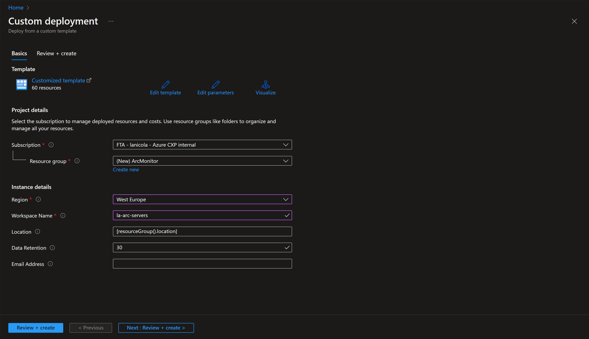

  

## Deployment Option 2: ARM template with Azure CLI

- Clone the Azure Arc Jumpstart repository

    ```shell
    git clone https://github.com/microsoft/azure_arc.git
    ```

- (Optional) If you already have a resource group with Azure Arc-enabled servers, please, proceed to the next step. Otherwise, create a new resource group for the scenario deployment and then, onboard your Azure Arc-enabled servers to that resource group. To create a new resource group, please, run the below command, replacing the values in brackets with your own:

    ```shell
    az group create --name <Name for your resource group> \
    --location <Location for your resources> \
    --tags "Project=jumpstart_azure_arc_servers"
    ```

    

- Next, edit the ARM template [parameters file](https://github.com/microsoft/azure_arc/blob/main/azure_arc_servers_jumpstart/monitoring/monitoring-template.json), providing a name for your Log Analytics workspace and a single email account, which will be used for Azure Monitor alerts notifications. Please, see the [example](https://github.com/microsoft/azure_arc/blob/main/azure_arc_servers_jumpstart/monitoring/monitoring-template.example.parameters.json) below:

    

- To deploy the ARM template, navigate to the [deployment folder](https://github.com/microsoft/azure_arc/tree/main/azure_arc_servers_jumpstart/monitoring) and run the below command:

    ```shell
    az deployment group create --resource-group <Name of the resource group where to deploy this scenario> \
        --template-file monitoring-template.json \
        --parameters monitoring-template.parameters.json
    ```

   

- When the deployment is complete, you should be able to see the resource group with your Log Analytics workspace, Azure dashboard, VMInsights solution and three Workbooks:

    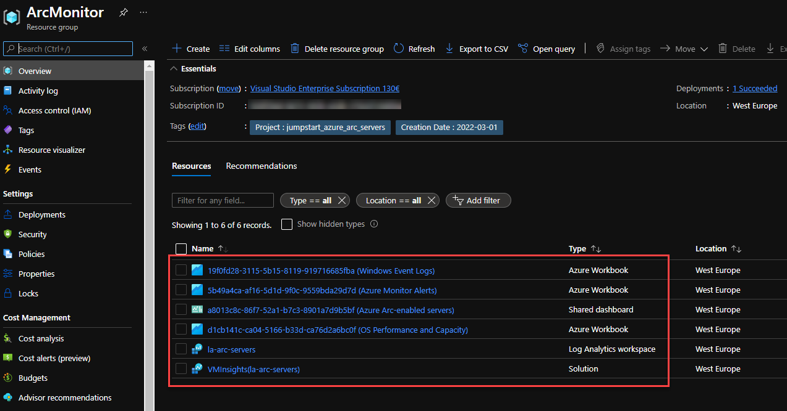

- Please, note that most of the deployed resources are hidden:

    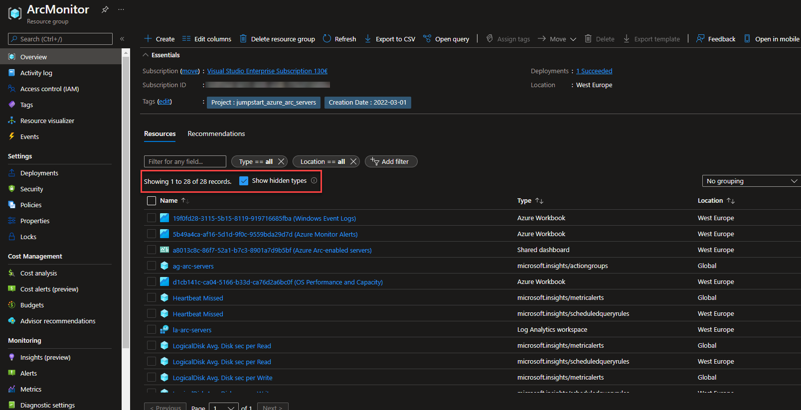

## Review that all the Azure Monitor deployed resources are configured

- Click on the **Policies** blade of the **resource group** where you deployed this scenario. Review that the following **four policies** are assigned:

    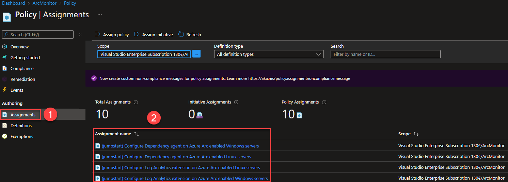

- Click on the **Agents Configuration** blade of the **Log Analytics workspace**. Review that the following **data sources** are already enabled as shown in the screenshots:

    

    

    

    

- Click on the **Solutions** blade of the **Log Analytics workspace**. Review that  **VMInsights** solution is enabled:

    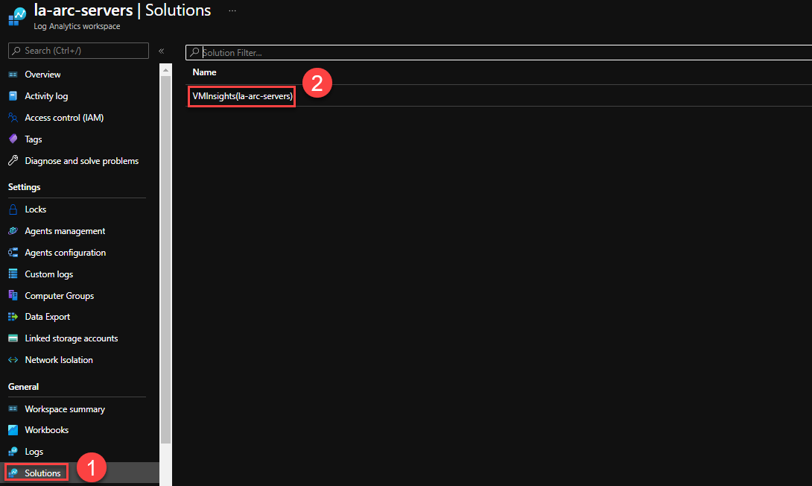

- Go to **Monitor**, **Alerts** and click on **Action Groups**:

    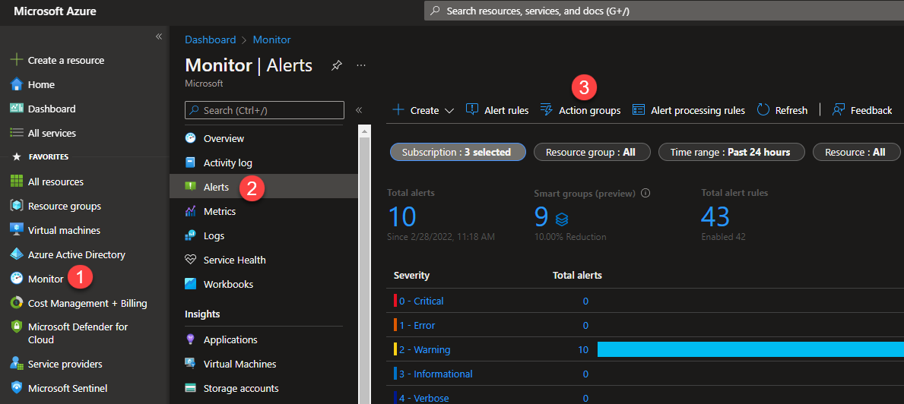

- Filter by **Subscription** and **Resource Group**. Review that the following **action group** is created:

    

- Click on the **action group name**, then on the **edit** button. Review that the **email account** is the one you provided in the **parameters file**:

    

    

- Go to **Monitor**, **Alerts** and click on **Alert rules**:

    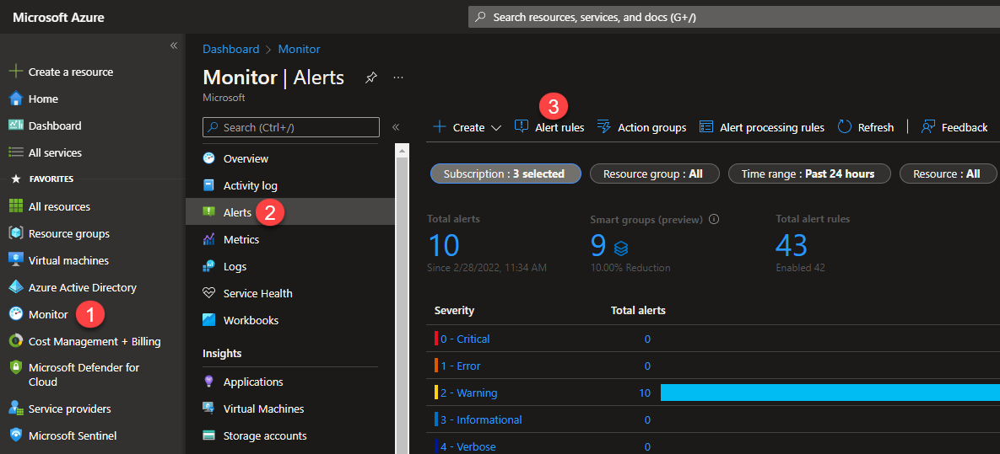

- Filter by **Subscription** and **Resource Group**. Review that the following **alerts** are enabled:

    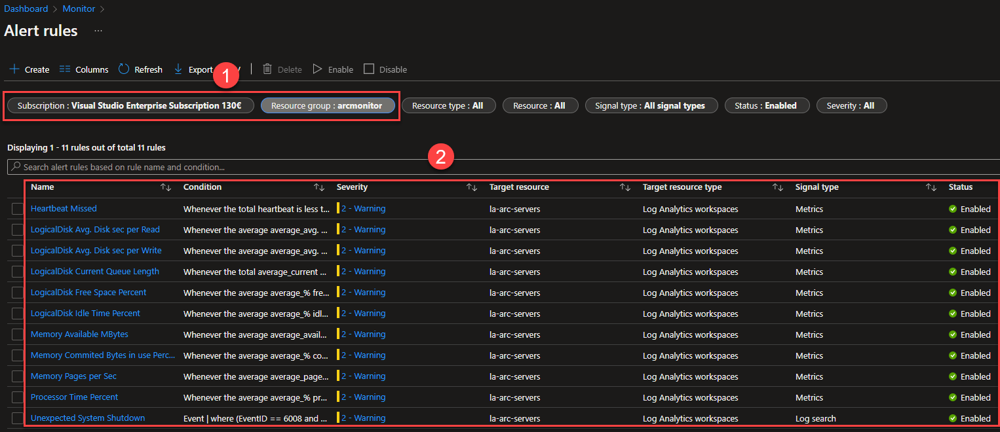

    > **NOTE: This is just a small example of Azure Monitor alerts, which are based on log queries and log analytics workspace metrics. You may need to adjust alerts thresholds to your environment expected behaviour.**

## Deploying the Log Analytics Agent and the Dependency Agent

This scenario is mainly based on the data collected from the Azure Arc-enabled servers into the Log Analytics workspace. Therefore, it is required to deploy on these servers the [Log Analytics Agent](https://docs.microsoft.com/azure/azure-monitor/agents/agents-overview#log-analytics-agent) and the [Dependency Agent](https://docs.microsoft.com/azure/azure-monitor/agents/agents-overview#dependency-agent). There are multiple [methods](https://docs.microsoft.com/azure/azure-monitor/agents/log-analytics-agent#installation-options) to deploy these agents. In this scenario, Azure Policies are used to deploy both agents in Windows and Linux.

For **new** Azure Arc-enabled servers connected within the scope of the policies assignments, the policies will deploy the agents automatically.

For **existing** Azure Arc-enabled servers connected within the scope of the policies assignments, you will need to manually create a remediation task for each policy. These are steps to create a remediation task:

- When the Azure Policies are assigned, it takes around 30 minutes for the assignment to be applied to the defined scope. After those 30 minutes, Azure Policy will start the evaluation cycle against the Azure Arc-enabled servers and recognize them as "Non-compliant" if they don't have the Log Analytics Agent or the Dependency Agent installed. To check this, go to the **resource group** where you deployed this scenario, and click on the **Policies** blade:

    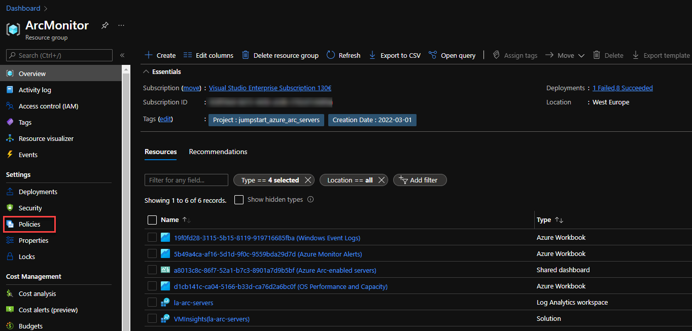

- Click on the **Remediation** tab. Check if any of the policies that deploy the agents have resources to remediate. If so, click on the **Remediate** button:

    > **NOTE: The following steps must be followed for each policy with resources pending to be remediated. Please, start with the remediation of the Log Analytics agent policies followed by the remediation of the Dependency Agent policies.**

    

- Review the following settings and click on the **Remediate** button:

    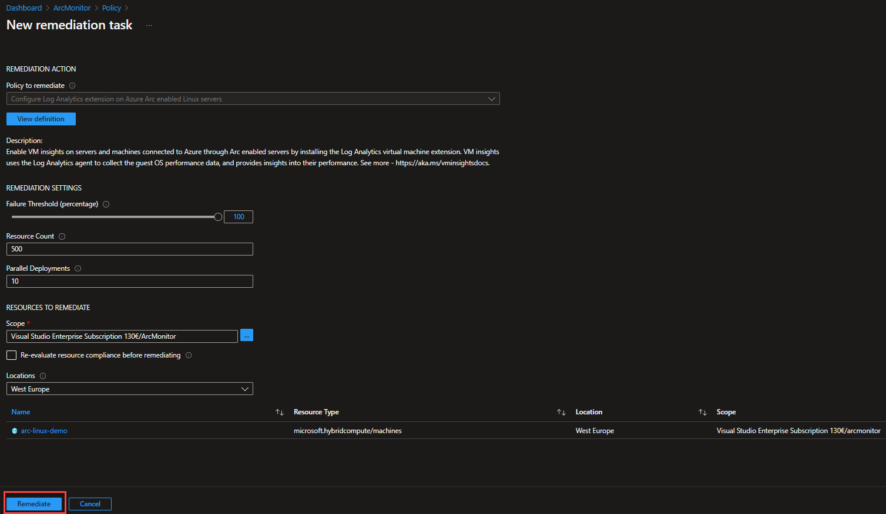

- Once you have assigned remediation task, the policy will be evaluated again and show that the Azure Arc-enabled server is compliant:

   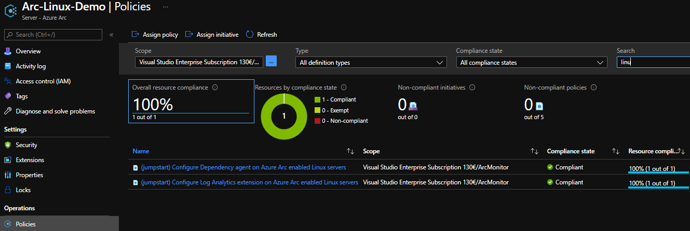

- The agents will be installed as **extensions** in the Azure Arc-enabled server:

   

## Azure Dashboard, Workbooks and VMInsights

Once the data starts arriving into the Log Analytics workspace, we can leverage Azure Monitor insights services like Azure Dashboard, Workbooks and VMInsights. It may take some hours for these services to have enough data to show.

### VMInsights

- Click on the **Insights** blade of one of the **Azure Arc-enabled servers** connected to the Log Analytics workspace:

   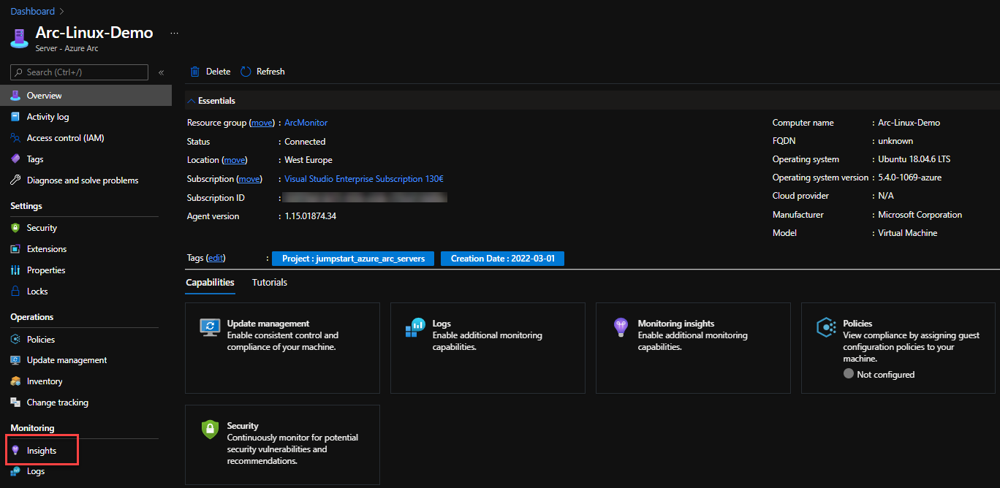

- Click on the **Performance tab**, which includes a set of charts that target several key performance indicators (KPIs) to help you determine how well a machine is performing:

   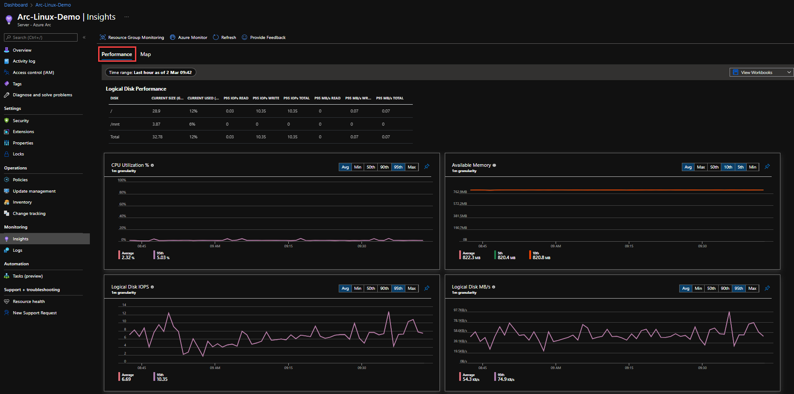

- Click on the **Map tab**, which visualizes the VM dependencies by discovering running processes that have active network connections between servers; inbound and outbound connection latency; ports across any TCP-connected architecture over a specified time range. Feel free to use the built-in workbooks available in the upper right corner:

   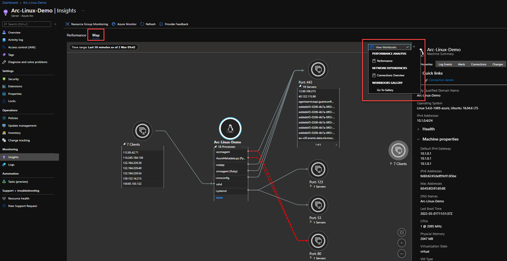

### Azure Dashboard and Workbooks

- Locate the **Shared Dashboard** that was deployed in your resource group. Click on its **name** and then on the **Go to dashboard** link:

   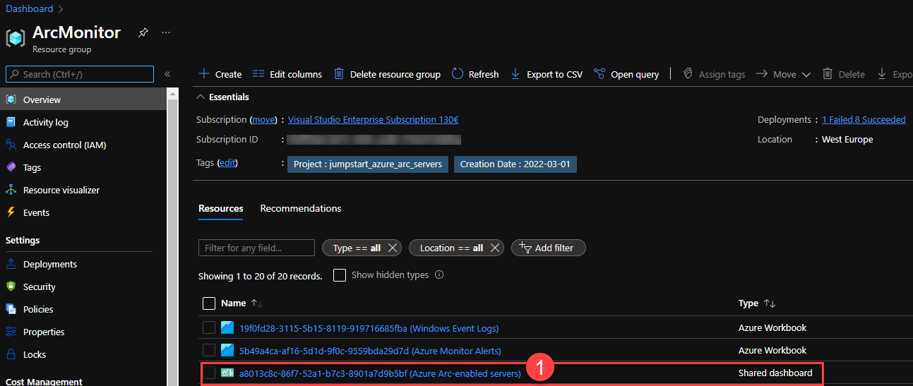

   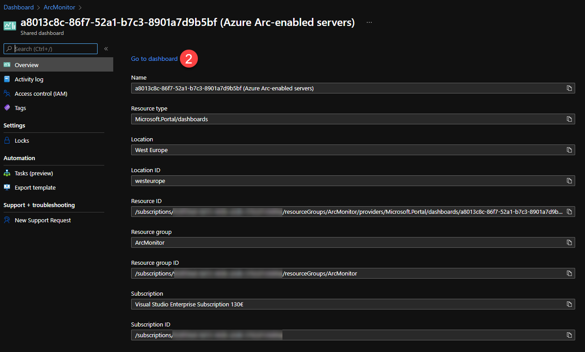

- The goal of this dashboard is to provide a quick overview of the current status of the monitored Azure Arc-enabled servers. You can play with the dashboards controls **Auto refresh** and **UTC Time**. Note that this dashboard is made up of three tiles, each of them being a quick access button and a summary of the deployed Azure workbooks:
  - **OSPerformanceAndCapacity:** provides a quick performance overview of the Azure Arc-enabled servers. In addition, it contains several charts with more insights of some key OS performance counters.
  - **AlertsConsole:** console that shows the alerts that have been fired within a time range.
  - **WindowsEvents:** Windows Events central visualizer.

   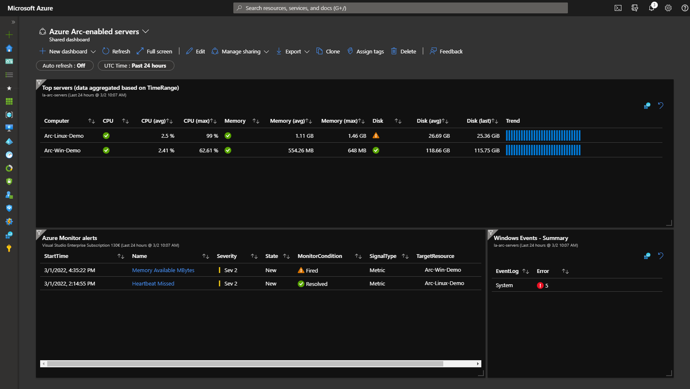

- To get into one of the pinned workbooks, like for example the **OSPerformanceAndCapacity** workbook, just click on the **Top servers** tile:

   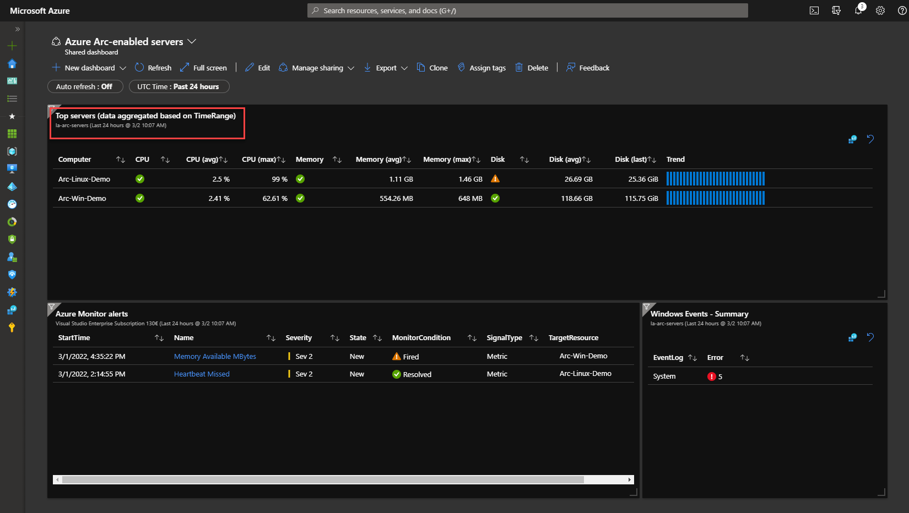

- This workbook, apart from the **Top servers** summary table available at the top of the **shared dashboard**, shows two charts for each of some of the key OS performance counters:

   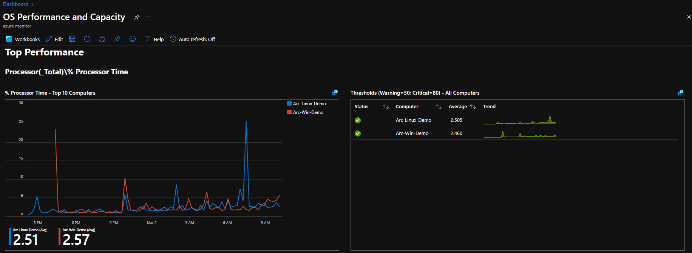

- In addition, at the bottom of this workbook, there are **two additional charts**. One of them shows which are the **processes that use more CPU for Windows machines**. The second one shows the **network usage by process per each Azure Arc-enabled server**:

   

- On the other hand, the **WindowsEvents workbook**, accessible from the **Shared Dashboard**, provides additional insights of the Windows Events collected. It shows the number of events by EventLog and Severity, along with its hourly distribution:

   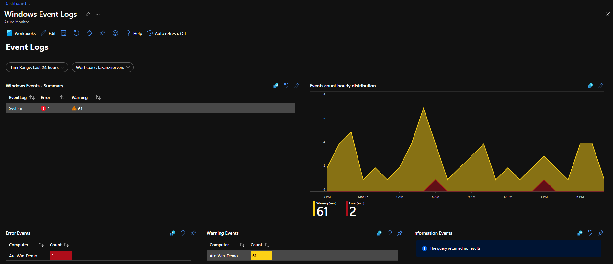

- At the bottom of the **WindowsEvents workbook**, click on one of the computers and its severity to load the table below, where all details per event are provided:

   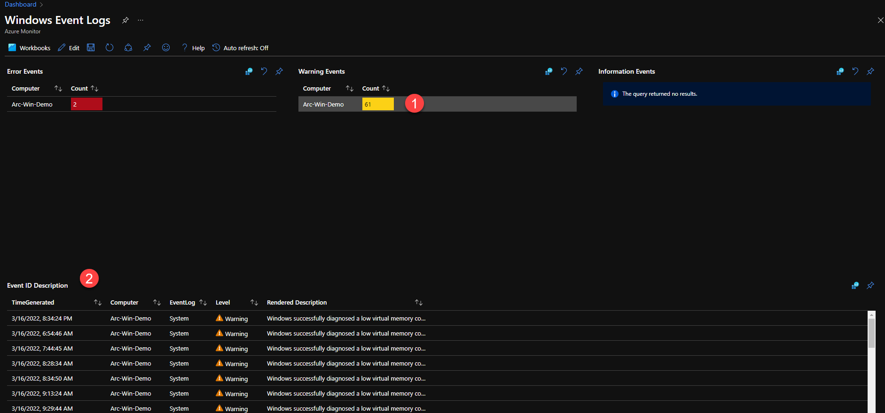

## Clean up environment

To delete the entire deployment, simply delete the resource group from the Azure portal.

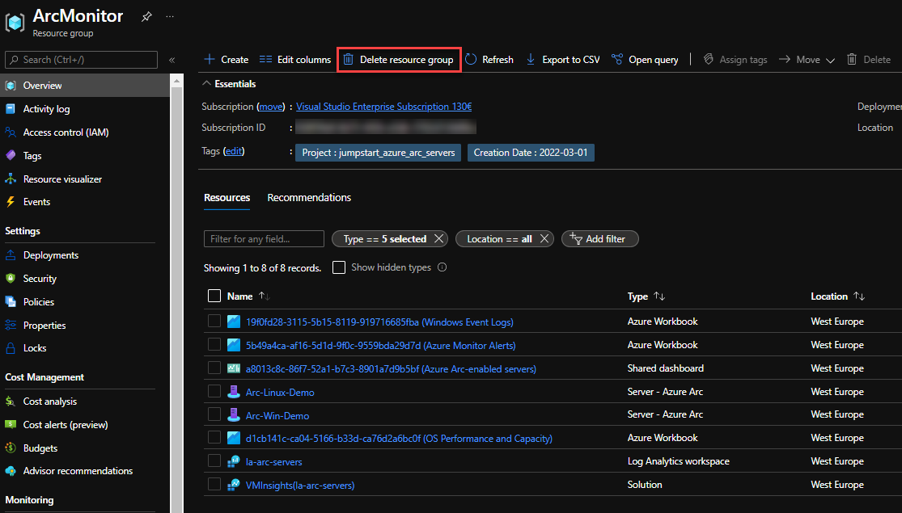
